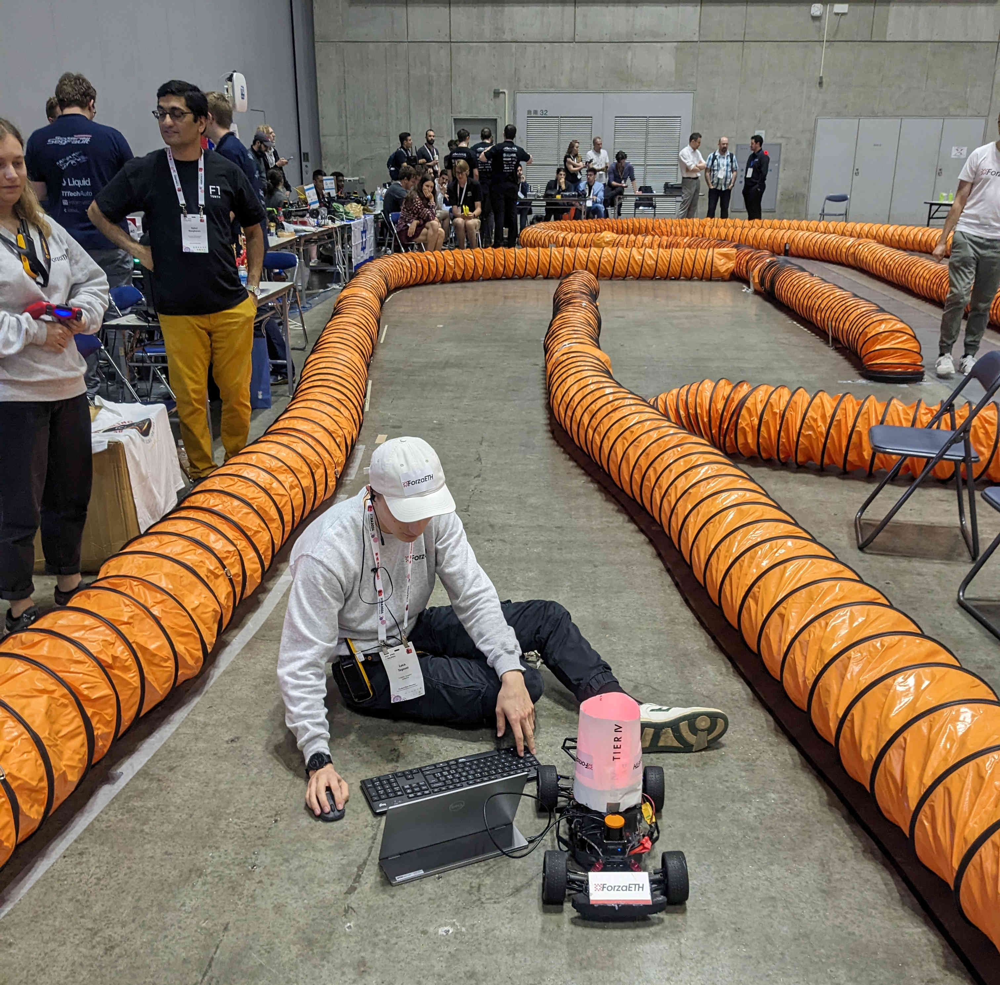

+++
author = "Luca Tognoni"
title = "ICRA 2024 F1TENTH GP"
title_short = "icra_24"
date = "2024-05-19"
tags = []
image = "blog/icra_24/cover.jpeg"
categories = ["Race"]
+++

The ForzaETH race team participated in the *15th F1TENTH Autonomous Racing Competition* at the International Conference on Robotics and Automation in Yokohama, Japan. Our team, consisting of five students with diverse expertise in robotics, spent several months preparing our cars and rehearsing racing procedures. For the first time, the race team was entirely student-led and consisted of bachelor and master students. 

Upon arriving in Japan, we immediately began training to optimize the tuning process. However, issues with the internet connection made the process considerably harder as live telemetry from the car was unavailable. Despite this setback, our familiarity with the car allowed us to achieve impressive lap times. During the time-trials phase, we qualified in 3rd place out of 18 teams from around the world, positioning us well for the head-to-head phase of the tournament.

Armed with a robust opponent detection algorithm and a newly developed overtaking system, we anticipated exciting races in the knockout stage. Unfortunately, the narrow track layout limited our ability to showcase our full potential, as it restricted safe overtaking.

Despite the lack of telemetry data during the races, we advanced undefeated to the semi-final, where we faced the *VAUL Blitz* team from Laval University in Quebec. The *VAUL Blitz* team, having qualified first in the time trials, thanks to impressive straight-line speed and won the semi-final, relegating us to the small final.

In the small final, we competed against a familiar rival, *Scuderia Segfault* from the Technical University of Vienna, whom we had faced in the finals of previous competitions. The race was intensely close, with both teams pushing their cars to the limit. After two nerve-wracking heats, we emerged victorious, securing 3rd place. This achievement once again demonstrated the reliability and performance of our ForzaETH race stack, solidifying our status as one of the top autonomous racing teams in the world.

We will continue developing our car to reclaim the title and look forward to competing again at IROS 2024.

