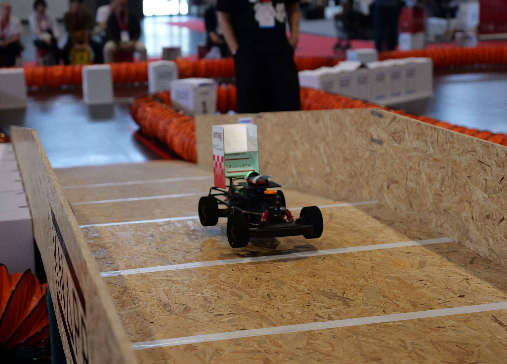
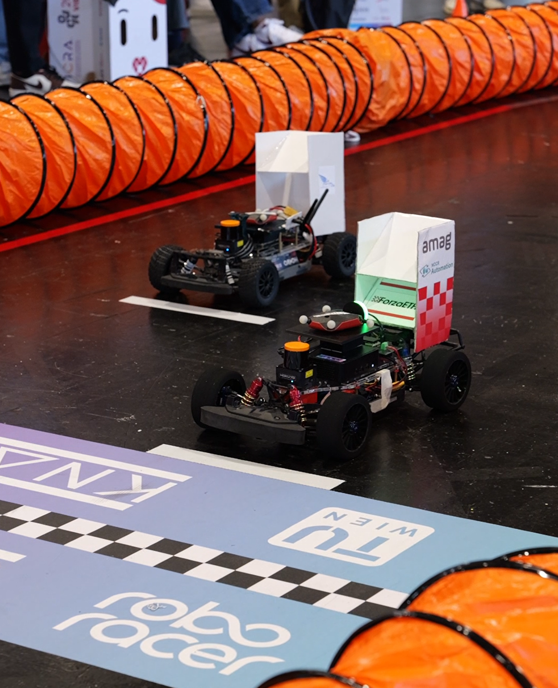

+++
author = "Mattia Dal Bò"
title = "ICRA 2026 Roboracer Competition"
title_short = "icra_26"
date = "2026-06-08"
tags = []
image = "blog/icra_26/Team.jpg"
categories = ["Race"]
+++

The [*27th RoboRacer Autonomous Racing Competition*](https://roboracer.ai/) is officially in the books. Our race team spent an incredible week at [*ICRA 2026*](https://2026.ieee-icra.org/) in **Vienna, Austria**, competing alongside some of the world's most talented autonomous racing teams.

This year's competition introduced several major challenges for the **183 participants**. Teams faced a massive 40 m × 20 m racetrack featuring a three-dimensional bridge at its center, as well as varying surface conditions, ranging from low-grip concrete sections to high-grip carpeted areas. Success required far more than outright speed: adaptability, reliability, strategic decision-making, and robust planning were all essential in a high-pressure racing environment.

Despite being a completely new team composed entirely of bachelor’s and master’s students, the Race Team invested significant effort both throughout the semester and on-site during the competition. With limited preparation time and the challenge of adapting to a previously unseen track, the team successfully overcame network communication and mapping issues and secured an impressive **third place** in the Time Trials. This result showcased both the speed of our platform and the reliability of our hardware and software stack.

The introduction of the 3D bridge, however, presented a unique challenge. Traversing the bridge introduced positional uncertainty due to the elevation changes along the track, affecting both the perception and planning modules. As a result, the car occasionally lost its localization in specific sections of the track. Despite these difficulties, the team ultimately secured **9th place out of 36 teams**.

Beyond the final ranking, the five days of competition were an invaluable learning experience. We would like to congratulate all participating teams and extend a special shoutout to the competition winners. It is inspiring to witness how rapidly the autonomous racing community continues to evolve and how the level of competition increases year after year.

We are already looking forward to the next race. And as always, we are not stopping here.

The ICRA26 Race Team: Mattia Dal Bò, Florian Jacques, Gil Jiménez, Hannah Marder, Muhan Sun, Sai Bommisetty, and Saimaneesh Yeturu.

A special thank you goes to our supervisors, Nicolas Baumann, Edoardo Ghignone, and Maurice Brunner, for their continuous guidance and support throughout the project.

We would also like to thank our sponsors and collaborators — **AMAG Lab**, **NCCR Automation**, the **Center for Project-Based Learning D-ITET**, and **Professor Michele Magno** — for their continued trust in our work and for providing the resources that enable our innovation.

Finally, we thank the ETH Hangar for providing an outstanding facility where we can develop, test, and train our autonomous racing systems.

See you at the next race! 🏁🏎️

