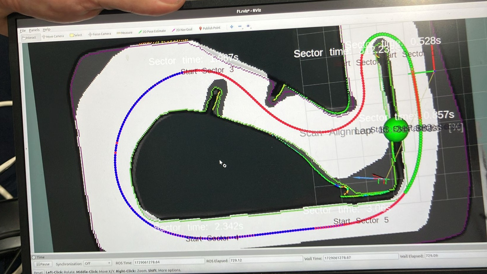
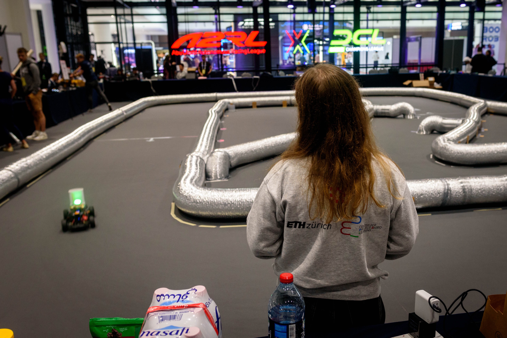

+++
author = "Tianyi Lim"
title = "IROS 2024 F1TENTH GP"
title_short = "iros_24"
date = "2024-10-18"
tags = []
image = "blog/iros_24/cover.jpg"
categories = ["Race"]
+++

The ForzaETH race team once again raced at the [*21st F1TENTH Autonomous Grand Prix*](https://iros2024-race.f1tenth.org/) at [IROS 2024](https://iros2024-abudhabi.org/) in Abu Dhabi, UAE. Following our 3rd place finish in Japan, the team worked hard to try to reclaim the title.

The floor surface at IROS proved to be extremely grippy carpet. While the track area was smaller than at previous competitions, the track layout was technical, with sweeping corners, a hairpin, and chicanes. By our estimates, this would provide more than twice the lateral grip than we faced in Japan. This was a surprise to us, as we had spent most of the preparation time on lower-grip surfaces. Would our hardware and software be up for the task in this unfamiliar grip regime?

*A bird's eye view of the map.*

During the free practice, the team was quickly able to obtain the all-imporant tire parameters with our new on-track system identification procedure. The time saved here allowed us to exhaustively try different racelines and controllers. With our car's relatively low weight and center of gravity, we were able to use an optimized version of a minimum curvature racing line. We then settled on [MAP](https://arxiv.org/abs/2209.04346) controller that has served us well previously. Our experience allowed us to extract as much out of our hardware as possible, as we chased tenths of seconds.

With some further tuning, we were able to drive with some precision, our car consistently almost brushing each corner apex as we chased higher and higher cornering speeds. The truly fast-paced nature of this racetrack proved challenging -- the car's hardware was pushed to its limit, and our state estimation and control algorithms had never before seen these high accelerations. Still, our [race stack](https://github.com/ForzaETH/race_stack) could consistently perform fast laps around the track. This gave us confidence pushing forward into the *Time-Trials* phase.

In Time-Trials, we faced two familar opponents and friends -- [*Dzik Ultimate*](https://www.linkedin.com/in/lsztyber/) from Poland and [*Scuderia Segfualt*](https://www.tuwien.at/inf/f1tenth/). Teams had to choose beforehand whether to go for *consistency* (number of consecutive laps without crashing) over *performance* (best overall lap time) in the two time-trial heats.

In the first heat, we opted for consistency, attaining **40** laps without crashing over 5 minutes -- an average of under 7.5 seconds per lap. Having secured a strong baseline, we then turned up our pace in the second heat, pushing the car's pace continually higher. Ultimately, we achieved a **7.14s** lap. Over the roughly 35m track, this represents an average speed of ~5m/s (18kph) -- significant considering the curvature of the track and the relatively short straights! The car accelerated at 8 ms2 and braked at 20 ms2 -- acclerations that mimic full-scale racing.

Ultimately, our team placed **2nd** out of 6 teams in qualification, slotting behind Dzik Ultimate (6.6s) and ahead of Scuderia Segfault (7.4s). If we wanted a chance to take the overall win, we needed to find even more pace...

Before the Head-to-head race, we continued to attempt to find more pace to close the ~0.5s gap to Dzik Ultimate, trying out our bleeding-edge Reinforcement Learning residual controller (paper soon!) and even doubling the current limit on our car's ESC. Unfortunately, all these experimental changes did not give us the performance we needed, and showed the limit of our software performance.

During the Head-to-head race, we were pitted against *Scuderia Segfault* first, in a best-of-3 knockout. The tuning we did previouly meant we reduced the safety margins excessively, and in the first round, our car exceeded track-limits too often, leading to our disqualification in that round despite our car being faster. We expected to be able to win on pace in the second round, however a software glitch occured and caused our car's performance to drop drastically. Disappointingly, we were knocked out, leaving us with overall 3rd place.

Still, we are satisfied with our performance this competition. During practice, we were able to **trail** slower opponents and overtake them with [Predictive Spliner](https://github.com/ForzaETH/predictive-spliner), our overtaking algorithm that estimates the opponent's trajectory, and allows us to make some really awesome overtakes!

At the end of the competition, we even had a demo 3-car race with *Scuderia Segfault* -- a sneak peek of things to come. While we can't say that any team was particularly performant over the race, we're excited for the future of F1TENTH!

See you at the next competition -- CDC 2024 in Milano, or ICRA 25 in Atlanta!

