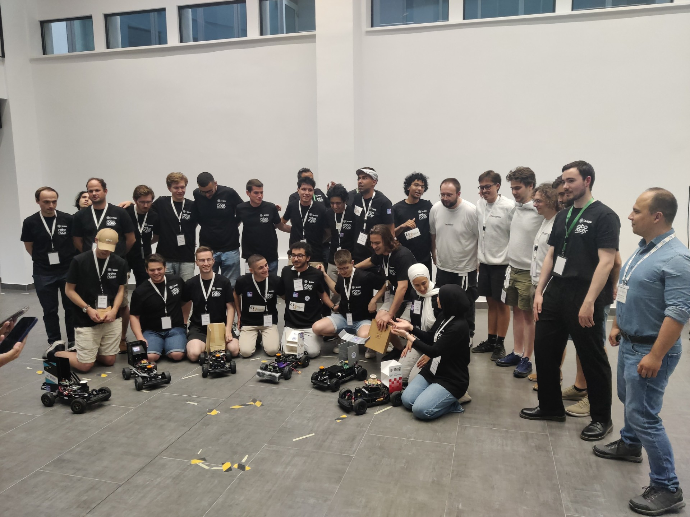
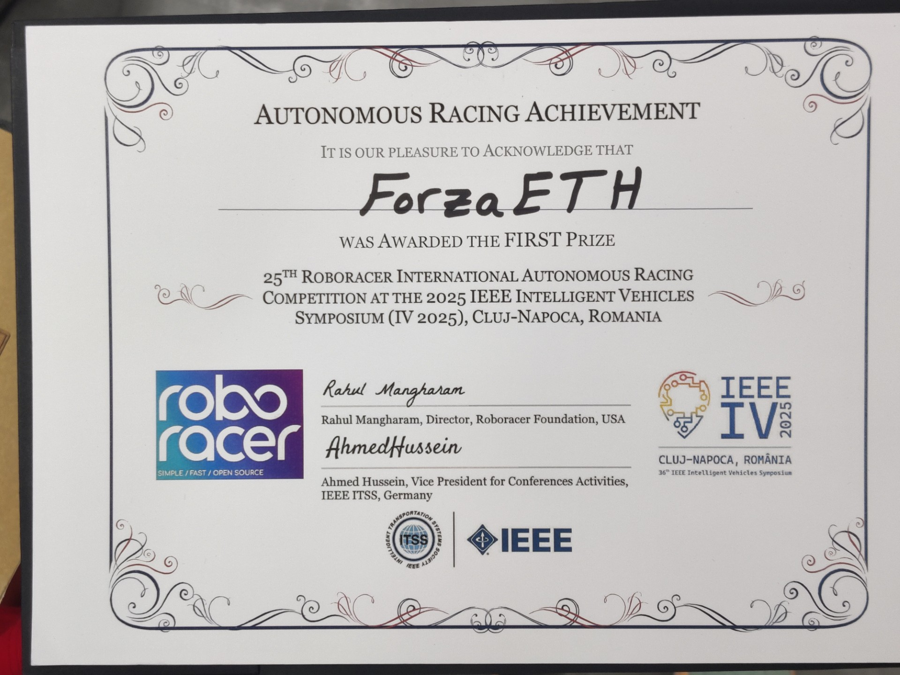

+++
author = "Neil Reichlin"
title = "IV 2025 Roboracer Competition"
title_short = "iv_25"
date = "2025-07-22"
tags = []
image = "blog/iv_25/cover.jpg"
categories = ["Race"]
+++

Last week, our team had the opportunity to compete in the [*25th Roboracer Competition*](https://roboracer.ai/), held during the [*Intelligent Vehicles Symposium 2025*](https://ieee-iv.org/2025/) in the beautiful city of *Cluj-Napoca, Romania*.

The track, while visually simple, turned out to be deceptively difficult. A thick layer of dust on the floor created low-friction conditions that made precise control difficult and impacted system identification.
The race was not just about raw speed, adaptibility and consistency turned out to be the deciding factors.

Our team quickly came together to analyze telemetry and test new configurations. By making swift adjustments and leaning on our modular race stack, we were able to regain stability and maintain competitive lap times.

During early testing, our car demonstrated dominant speed and responsiveness. But with the slippery track and the race format favoring endurance, minimizing mistakes and ensuring stable lap-to-lap performance became our top priority.

The event itself was extremely well organized. The atmosphere throughout the event was both professional and exciting. The final race was amazing. With a crowd of spectators, live commentary, and beautiful overtakes during head-to-head racing, it captured the spirit of the competition perfectly.

In the final round, our car performed a series of precise overtakes, navigating the tight and slippery corners with confidence. The final laps were intense, but thanks to the stability of our algorithms and the composure of our team, we secured the **first place**.

We also want to acknowledge the strong efforts from the other teams. Many delivered solid performances and brought fresh ideas to a very challenging track. **Sombreros off** to everyone!

None of this would have been possible without the support of the incredible event organizers, who ran a seamless and memorable competition. We’d also like to sincerely thank our sponsors, **Amag Lab** and **NCCR Automation**, for their continued belief in our work and for providing the resources that power our innovation.

This experience has only strengthened our commitment to pushing the boundaries of autonomous racing. With new insights and a championship win under our belts, we're already looking forward to the next challenge.

