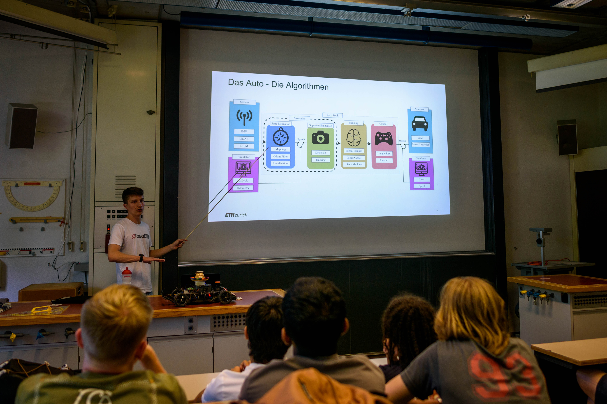

+++
author = "Luca Tognoni"
title = "ForzaETH inspiring the next generation of engineers"
title_short = "school_presentation"
date = "2024-06-27"
image = "blog/school_presentation/cover.jpg"
tags = [
]
series = ["Exhibitions"]
[header]
image = "school_presentation/cover.jpg"
+++

## Presentation at the Kantonsschule Zürich Nord

ForzaETH had the opportunity to present our project to the students of the Kantonsschule Zürich Nord. Led by team members Luca, Charlotte, and Tian Yi, the presentation aimed to spark interest in engineering and autonomous technology among high school students. We discussed everything from the basic principles of our racing algorithms to the intricate details of our competition experiences.

We also had the opportunity to showcase a race between two of our race cars, which captivated the audience and demonstrated the complexity and excitement of autonomous racing. Their reactions reaffirmed our belief in the importance of outreach. It's clear that events like these can ignite a passion for engineering in the next generation.

This experience wasn't just beneficial for the students; it also provided our team with valuable insights. Presenting our work to a younger audience helped us refine our communication skills and reminded us of the importance of inspiring future engineers.

Looking ahead, we hope to continue our outreach efforts, building connections with more schools and organizations to promote the importance of STEM education. We’re excited to see where this journey takes us next and hope to inspire many more young minds along the way.

